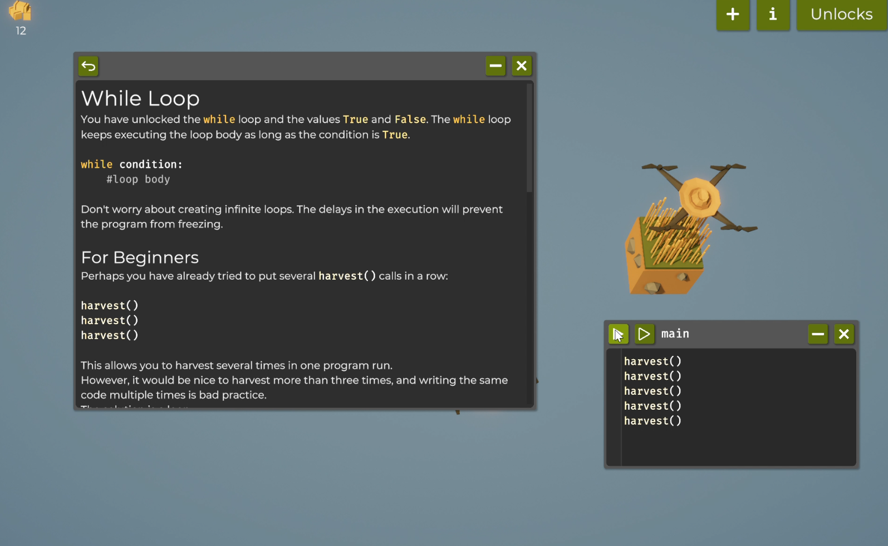
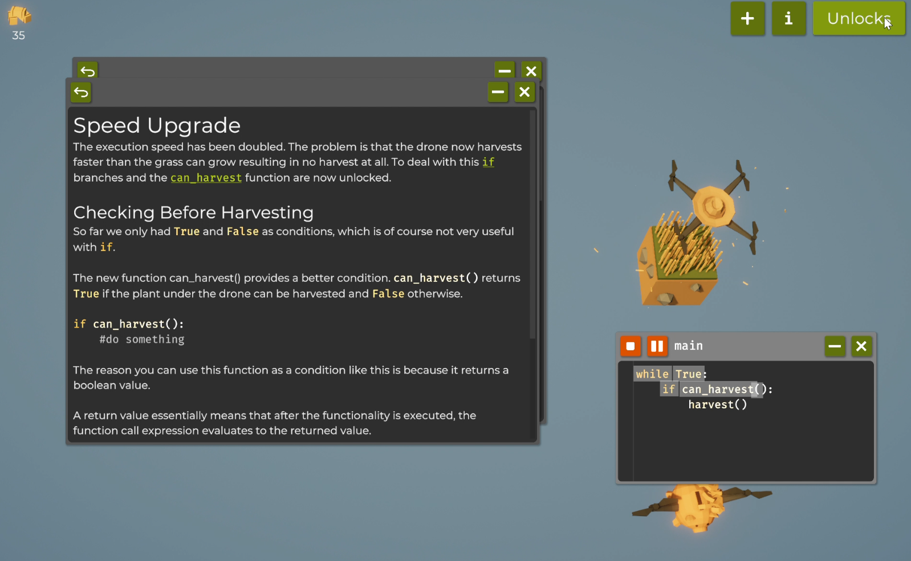
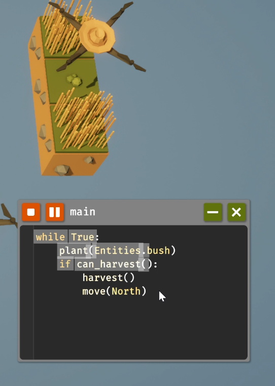
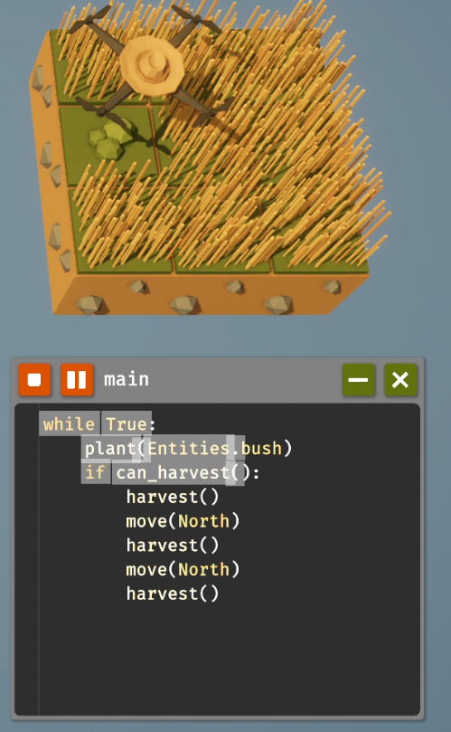
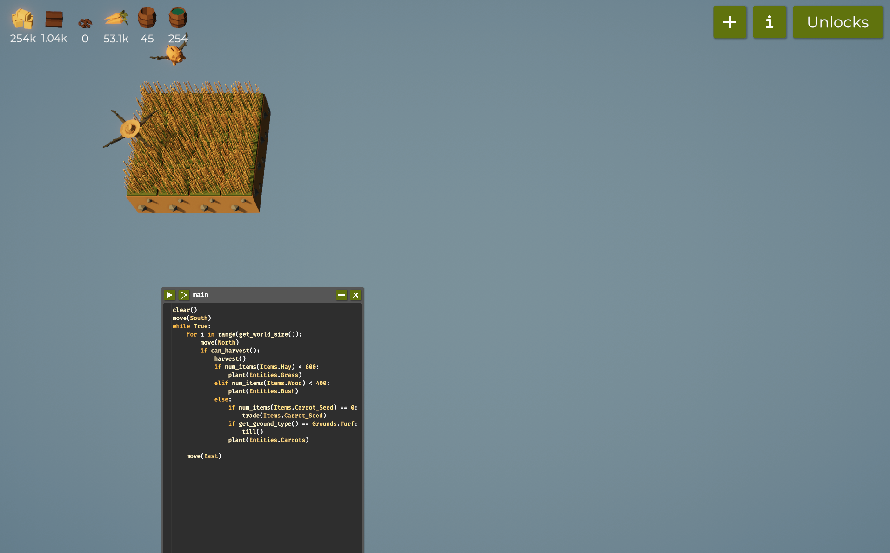
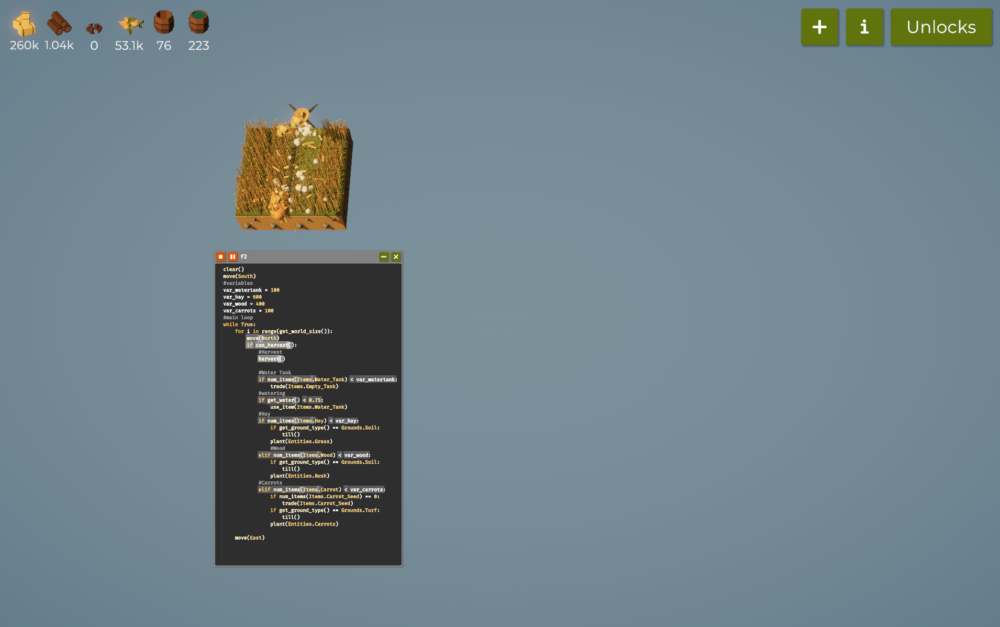
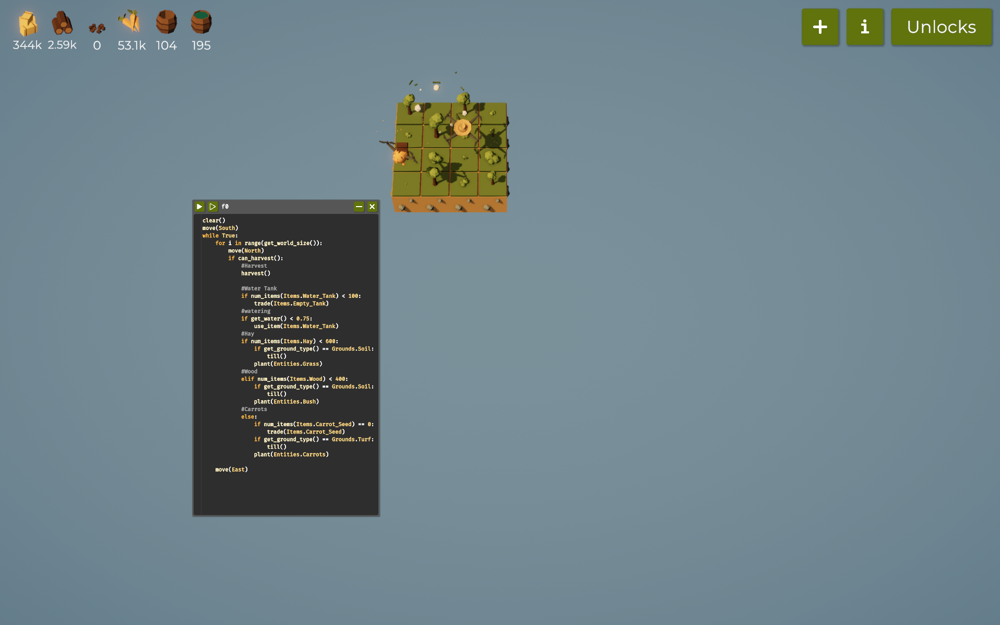
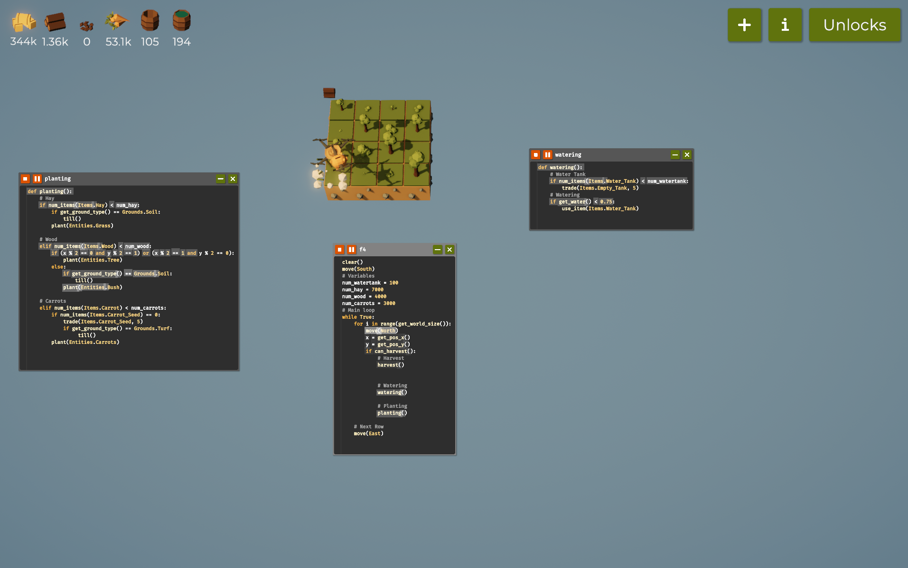
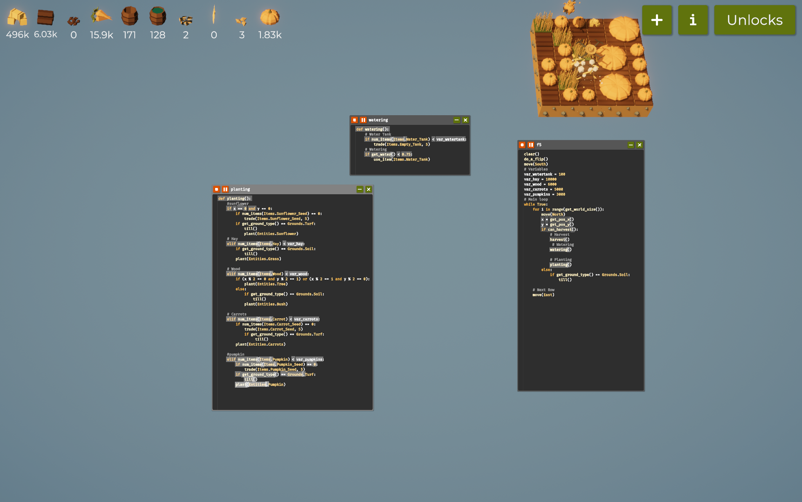
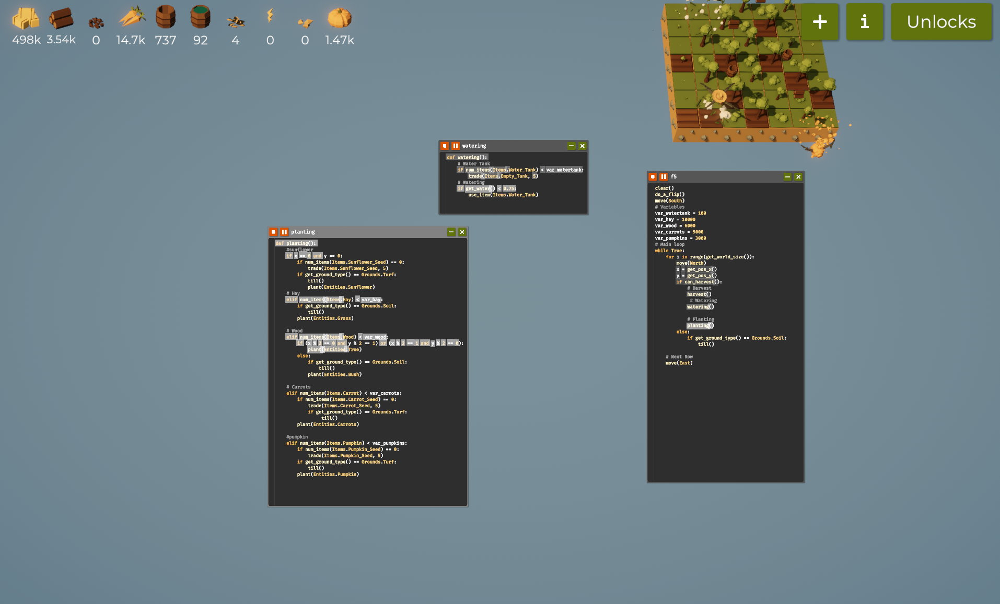

# SWE_CAP2_Game_Automation

### *Brief Description of the Game:*

In *"The Farmer was Replaced"*, I step into the boots of a virtual farmer, managing my very own plot of land. My tasks include planting crops, harvesting produce, and caring for animals. I explore my farm, gather resources, and upgrade tools to make everything run more smoothly. Along the way, I face challenges like weather changes, pests, and keeping up with market demands, all of which keep me on my toes and make every decision matter.

### *Objective of the Game:*

My goal in this game is to build a thriving, profitable farm. I aim to grow different crops, raise animals, and increase my farm’s productivity and income. As I expand, I complete quests and tackle goals like reaching income milestones or producing a certain amount of goods. My ultimate mission is to create the most successful and sustainable farm I can.


# *Table of Contents*
- [Code Snippets and Explanation](#code-snippets-and-explanation)
- [Challenges and Learnings](#challenges-and-learnings)
- [References](#references)


# Code Snippets and Explanation

### Step 1: Farming on 1 Tile
---
#### *Code:*

```python
harvest()
harvest()
harvest()
harvest()
harvest()
```

#### *Explanation:*

The code runs collecting 5 hays, because I have written five harvest() which collects one hay per harvest. And then I unlocked the Loops.

---
#### *screenshots*



---
#### *Code:*

```python
while True:
    if can_harvest():
        harvest()
```

#### *Explanation:*

In this code, the drone continue harvesting (can_harvest) for infinite loops unless the condition is True and otherwise it does a flip by defining the do_a_flip() function. 

#### *screenshots*



### *Code:*

```python
while True:
    plant(Entities.Bush)
    if can_harvest():
        harvest()
        move(North)
```
#### *Explanation:*

The drone was spending too much time waiting for bushes to become ready for harvesting. To improve efficiency, I added an else statement that directs the drone to move north instead. This change allows it to focus on harvesting grass and wood without unnecessary delays.

#### *Explanation:*



### *Note:*
---
- Increased tile size from 1 x 1 to 1 x 3.
- Enabled a speed upgrade for the drone.
- Enhanced grass to boost yield.
- Activated a sensor to detect nearby surroundings.
- Added operators to implement conditional logic.


---

### Step 2: Farming on a 3 x 3 Tile
---

#### *Code:*

```python
while True:
   plant (Entities bush)
   if can harvest():
      harvest()
      move(North)
      harvest()
      move (North)
      harvest()
```


#### *Explanation:*

In this setup, I use a 3 x 3 tile layout and loops to guide the drone across the grid. The code begins with clear() to reset the environment, and move(South) repositions the drone to its starting point. As it moves north using move(North), the drone checks if harvesting is possible with can_harvest(), and if so, it performs harvest(). If the hay count is below 500 (checked using num_items(Items.Hay)), the drone plants grass with plant(Entities.Grass). Otherwise, it plants bushes for wood. Finally, move(East) progresses the drone to the next column.

---

#### *screenshots*



---

#### *Code:*

```python
clear()
move(South)
while True:
    for i in range(get_world_size()):
        move(North)
        if can_harvest():
            harvest()
            if num_items(Items.Hay) < 600:
                plant(Entities.Grass)
            elif num_items(Items.Wood) < 400:
                plant(Entities.Bush)
            else:
                if num_items(Items.Carrot_Seed) == 0:
                    trade(Items.Carrot_Seed)
                if get_ground_type() == Grounds.Turf:
                    till()
                plant(Entities.Carrots)
    move(East)
```


#### *Explanation:*

This code builds on the previous logic, introducing conditional planting based on inventory levels. The num_items() function is used to check hay and wood levels. If they fall below 600 or 400, respectively, the drone plants grass or bushes using plant(Entities.Grass) or plant(Entities.Bush). If carrot seeds are unavailable (num_items(Items.Carrot_Seed) == 0), trade(Items.Carrot_Seed) is called to obtain more seeds. Before planting carrots, get_ground_type() checks if the ground is turf, and if it is, till() is called to prepare the soil.

---

#### *screenshots*



---

#### *Code:*

```python
clear()
move(South)
while True:
    for i in range(get_world_size()):
        move(North)
        if can_harvest():
            harvest()
            if num_items(Items.Water_Tank) < 100:
                trade(Items.Empty_Tank)
            if get_water() < 0.75:
                use_item(Items.Water_Tank)
            if num_items(Items.Hay) < 600:
                if get_ground_type() == Grounds.Soil:
                    till()
                plant(Entities.Grass)
            elif num_items(Items.Wood) < 400:
                if get_ground_type() == Grounds.Soil:
                    till()
                plant(Entities.Bush)
            else:
                if num_items(Items.Carrot_Seed) == 0:
                    trade(Items.Carrot_Seed)
                if get_ground_type() == Grounds.Turf:
                    till()
                plant(Entities.Carrots)
    move(East)
```

#### *Explanation:*

This version includes watering to ensure crop health. Using num_items(Items.Water_Tank), the code checks if the inventory has sufficient water tanks; if not, it calls trade(Items.Empty_Tank) to refill. get_water() checks the current water level, and if it falls below 75%, use_item(Items.Water_Tank) is used to water the crops. Before planting grass or bushes, get_ground_type() verifies that the ground is soil, and till() prepares it if needed.

---


---

#### *Code:*

```python
clear()
move(South)
# Variables
var_watertank = 100
var_hay = 600
var_wood = 400
var_carrots = 100
# Main Loop
while True:
    for i in range(get_world_size()):
        move(North)
        if can_harvest():
            harvest()
            if num_items(Items.Water_Tank) < var_watertank:
                trade(Items.Empty_Tank)
            if get_water() < 0.75:
                use_item(Items.Water_Tank)
            if num_items(Items.Hay) < var_hay:
                if get_ground_type() == Grounds.Soil:
                    till()
                plant(Entities.Grass)
            elif num_items(Items.Wood) < var_wood:
                if get_ground_type() == Grounds.Soil:
                    till()
                plant(Entities.Bush)
            elif num_items(Items.Carrot) < var_carrots:
                if num_items(Items.Carrot_Seed) == 0:
                    trade(Items.Carrot_Seed)
                if get_ground_type() == Grounds.Turf:
                    till()
                plant(Entities.Carrots)
    move(East)
```

#### *Explanation:*

In this iteration, variables are introduced to track target inventory levels. num_watertank, num_hay, num_wood, and num_carrots store the desired quantity for each item. The code then compares these variables against num_items() checks. The trade() function is used for refilling water tanks and acquiring carrot seeds when necessary, and use_item() maintains the water level above 75%. Ground type checks with get_ground_type() ensure appropriate tilling with till() before planting.

---

#### *screenshots*



---

### *Note:*
- Carrots have been unlocked.
- Variables are now used for managing item targets.
- Watering functionality is added for crop management.

---

---

### Step 4: Farming on 4 x 4 Tile

---

### *Code:*

```python
clear()
move(South)
# Variables
var_watertank = 100
var_hay = 2000
var_wood = 1000
var_carrots = 800
# Main loop
while True:
    for i in range(get_world_size()):
        move(North)
        x = get_pos_x()
        y = get_pos_y()
        if can_harvest():
            # Harvest
            harvest()
            
            # Water Tank
            if num_items(Items.Water_Tank) < var_watertank:
                trade(Items.Empty_Tank)
                
            # Watering
            if get_water() < 0.75:
                use_item(Items.Water_Tank)
                
            # Hay
            if num_items(Items.Hay) < var_hay:
                if get_ground_type() == Grounds.Soil:
                    till()
                plant(Entities.Grass)
                
            # Wood
            elif num_items(Items.Wood) < var_wood:
                if (x % 2 == 0 and y % 2 == 1) or (x % 2 == 1 and y % 2 == 0):
                    plant(Entities.Tree)
                else:
                    if get_ground_type() == Grounds.Soil:
                        till()
                    plant(Entities.Bush)
    
            # Carrots
            elif num_items(Items.Carrot) < var_carrots:
                if num_items(Items.Carrot_Seed) == 0:
                    trade(Items.Carrot_Seed)
                if get_ground_type() == Grounds.Turf:
                    till()
                plant(Entities.Carrots)
    
    move(East)
```

### *Explanation:*

In this code, I use a 4x4 tile setup to maximize efficiency by incorporating grid-based tree planting. By checking the coordinates x and y (retrieved with get_pos_x() and get_pos_y()), trees and bushes are planted in a checkerboard arrangement to ensure optimal spacing. The code begins with clear() to reset the environment and move(South) to position the drone at the start. It proceeds north, checking if resources like hay, wood, and carrots are below target thresholds and planting accordingly.

---

#### *screenshots*



---

### *Main Function*

```python
clear()
move(South)
# Variables
var_watertank = 100
var_hay = 7000
var_wood = 4000
var_carrots = 3000
# Main loop
while True:
    for i in range(get_world_size()):
        move(North)
        x = get_pos_x()
        y = get_pos_y()
        if can_harvest():
            # Harvest
            harvest()
            
            # Watering
            watering()
            
            # Planting
            planting()
    
    # Next Row
    move(East)
```


*Planting Function*

```python
def planting():
    # Hay
    if num_items(Items.Hay) < var_hay:
        if get_ground_type() == Grounds.Soil:
            till()
        plant(Entities.Grass)
                
    # Wood
    elif num_items(Items.Wood) < var_wood:
        if (x % 2 == 0 and y % 2 == 1) or (x % 2 == 1 and y % 2 == 0):
            plant(Entities.Tree)
        else:
            if get_ground_type() == Grounds.Soil:
                till()
            plant(Entities.Bush)
    
    # Carrots
    elif num_items(Items.Carrot) < var_carrots:
        if num_items(Items.Carrot_Seed) == 0:
            trade(Items.Carrot_Seed, 5)
        if get_ground_type() == Grounds.Turf:
            till()
        plant(Entities.Carrots)
```

*Watering Function*

```python
def watering():
    # Water Tank
    if num_items(Items.Water_Tank) < var_watertank:
        trade(Items.Empty_Tank, 5)
    # Watering
    if get_water() < 0.75:
        use_item(Items.Water_Tank)
```

### *Explanation:*

With functions enabled, watering and planting are broken into separate functions, streamlining the main code. watering handles water tank trading and usage to keep water levels sufficient, while planting checks inventory and ground conditions to determine which crops to plant. The multi-trade feature enables trading seeds and tanks in batches of 5, minimizing disruptions.

---

#### *screenshots*



---

### *New Crops: Sunflowers and Pumpkins*

```python
clear()
do_a_flip()
move(South)
# Variables
var_watertank = 100
var_hay = 10000
var_wood = 6000
var_carrots = 5000
var_pumpkins = 600
# Main loop
while True:
    for i in range(get_world_size()):
        move(North)
        x = get_pos_x()
        y = get_pos_y()
        if can_harvest():
            # Harvest
            harvest()
            
            # Watering
            watering()
            
            # Planting
            planting()
        else:
            if get_ground_type() == Grounds.Soil:
                till()
                
    # Next Row
    move(East)


def planting():
    # Sunflower
    if x == 0 and y == 0:
        if num_items(Items.Sunflower_Seed) == 0:
            trade(Items.Sunflower_Seed, 5)
        if get_ground_type() == Grounds.Turf:
            till()
        plant(Entities.Sunflower)
        
    # Hay
    elif num_items(Items.Hay) < var_hay:
        if get_ground_type() == Grounds.Soil:
            till()
        plant(Entities.Grass)
                
    # Wood
    elif num_items(Items.Wood) < var_wood:
        if (x % 2 == 0 and y % 2 == 1) or (x % 2 == 1 and y % 2 == 0):
            plant(Entities.Tree)
        else:
            if get_ground_type() == Grounds.Soil:
                till()
            plant(Entities.Bush)
    
    # Carrots
    elif num_items(Items.Carrot) < var_carrots:
        if num_items(Items.Carrot_Seed) == 0:
            trade(Items.Carrot_Seed, 5)
        if get_ground_type() == Grounds.Turf:
            till()
        plant(Entities.Carrots)
    
    # Pumpkins
    elif num_items(Items.Pumpkin) < var_pumpkins:
        if num_items(Items.Pumpkin_Seed) == 0:
            trade(Items.Pumpkin_Seed, 5)
        if get_ground_type() == Grounds.Turf:
            till()
        plant(Entities.Pumpkin)
```


### *Explanation:*

#### Sunflower Planting:
The function now plants sunflowers at a designated grid location (x == 0 and y == 0) to maintain a consistent spot. When sunflower seeds are insufficient, trade(Items.Sunflower_Seed, 5) acquires a batch of seeds, and till() preps the ground for optimal growth.

#### Pumpkin Planting:
The code ensures there’s a steady supply of pumpkins by checking if pumpkin inventory falls below 600. When needed, it calls trade(Items.Pumpkin_Seed, 5) for seeds, checks the ground type, and plants pumpkins in suitable locations.

---

#### *screenshots*



### *Notes:*
1. *Unlocked Functionalities:*
   - Defined custom functions for modular code.
   - Multi-trade and efficient carrot and tree planting patterns.
   
2. *Benefits:*
   - Improved code readability with separated logic.
   - Efficient resource management across different crop types.

---

## Step 5: Farming on a 5 x 5 Tile

### *Code:*
```python
clear()
do_a_flip()
move(South)
# Variables
var_watertank = 100
var_hay = 20000
var_wood = 16000
var_carrots = 1400
var_pumpkins = 10000
# Main loop
while True:
	for i in range(get_world_size()):
		move(North)
		x = get_pos_x()
		y = get_pos_y()
		if can_harvest():
			
			# Harvest
			harvest()
			
			# Watering
			watering()
			
			# Planting
			planting()
		else:
			if get_ground_type() == Grounds.Soil:
				till()
				
	# Next Row
	move(East)


def planting():
	# Sunflower
	if x == 0 and y == 0:
		if num_items(Items.Sunflower_Seed) == 0:
			trade(Items.Sunflower_Seed, 5)
		if get_ground_type() == Grounds.Turf:
			till()
		plant(Entities.Sunflower)
		
	# Hay
	elif num_items(Items.Hay) < var_hay:
		if get_ground_type() == Grounds.Soil:
			till()
		plant(Entities.Grass)
				
	# Wood
	elif num_items(Items.Wood) < var_wood:
		if (x % 2 == 0 and y % 2 == 1) or (x % 2 == 1 and y % 2 == 0):
			plant(Entities.Tree)
		else:
			if get_ground_type() == Grounds.Soil:
				till()
			plant(Entities.Bush)
	
	# Carrots
	elif num_items(Items.Carrot) < var_carrots:
		if num_items(Items.Carrot_Seed) == 0:
			trade(Items.Carrot_Seed, 5)
		if get_ground_type() == Grounds.Turf:
			till()
		plant(Entities.Carrots)
		
	# Pumpkins
	elif num_items(Items.Pumpkin) < var_pumpkins:
		if num_items(Items.Pumpkin_Seed) == 0:
			trade(Items.Pumpkin_Seed, 5)
		if get_ground_type() == Grounds.Turf:
			till()
		plant(Entities.Pumpkin)


def watering():
		# Water Tank
		if num_items(Items.Water_Tank) < var_watertank:
			trade(Items.Empty_Tank, 5)
		# Watering
		if get_water() < 0.75: 
			use_item(Items.Water_Tank)
```

### *Explanation:*
At this stage, where the farming tile has been expanded to a 5 x 5 grid, I enhanced efficiency by increasing both the drone’s speed and the yield for various entities. These upgrades allow the farming cycle to progress more swiftly and with larger harvests for each item, unlocking additional functions essential for scaling up.

---

## Step 6: Farming on a 6 x 6 Tile

### *Code:*
```python
# Main loop
while True:
	for i in range(get_world_size()):
		# Buy seeds
		if num_items(Items.Sunflower_Seed) < 100:
			trade(Items.Sunflower_Seed, get_world_size())
		if num_items(Items.Carrot_Seed) < 100:
			trade(Items.Carrot_Seed, get_world_size())
		if num_items(Items.Pumpkin_Seed) < 100:
			trade(Items.Pumpkin_Seed, get_world_size())
			
		move(North)
		x = get_pos_x()
		y = get_pos_y()
		if can_harvest():
			
			# Harvest
			harvest()
			
			# Watering
			watering()
			
			# Planting
			planting()
		else:
			if get_ground_type() == Grounds.Soil:
				till()
```


### *Explanation:*
---
In this code, I introduced a way to maintain a steady supply of seeds to support uninterrupted farming. By setting thresholds, I programmed the system to automatically trade for seeds whenever the quantity drops below 100. Using get_world_size() to determine the trade amount ensures that the number of seeds matches the size of the managed area, keeping the inventory balanced.

This structure ensures that I don’t run out of seeds mid-cycle, thereby maintaining efficient planting and avoiding downtime. By managing resources this way, I can focus on optimizing crop placement and yield.

---


### *Notes:*
---
- *Upgrades Unlocked:* I have maximized upgrades for Grass, Trees, and Carrots, which has significantly boosted yields for hay, wood, and carrots. 
- *Farm Expansion:* I have now expanded the farm size to a 7 x 7 tile to accommodate more sunflowers, which provide additional power and help increase the drone's speed. 

This expansion has been an essential step toward optimizing the farm's output across multiple resources, facilitating greater harvest efficiency as the area grows.

---
## Step 7: Farming on a 7 x 7 Tile

### *Code:*
```python
clear()
do_a_flip()
move(South)

# Variables
var_watertank = 100
var_hay = 40000
var_wood = 35000
var_carrots = 35000
var_pumpkins = 20000
var_power = 1000

pedalList = list()
# Main loop
while True:
	for i in range(get_world_size()):
		# Buy seeds if needed
		if num_items(Items.Sunflower_Seed) < 100:
			trade(Items.Sunflower_Seed, get_world_size())
		if num_items(Items.Carrot_Seed) < 100:
			trade(Items.Carrot_Seed, get_world_size())
		if num_items(Items.Pumpkin_Seed) < 100:
			trade(Items.Pumpkin_Seed, get_world_size())
			
		move(North)
		x = get_pos_x()
		y = get_pos_y()

		# Harvest Sunflowers
		if can_harvest():
			if get_entity_type() == Entities.Sunflower:
				if measure() == max(pedalList):
					harvest()
					pedalList.remove(max(pedalList))
			else:
				# Harvest, Water, and Plant
				harvest()
				watering()
				planting()
		else:
			if get_ground_type() == Grounds.Soil:
				till()
				
	# Move to the next row
	move(East)
```

### *Explanation:*
---
In this part of the code, I use pedalList to monitor the growth progress of my sunflowers. After planting a sunflower, I immediately call measure() to record its growth level, then store this value in pedalList. This way, I have a list representing the maturity of each sunflower on the farm.

When a sunflower is ready to harvest, I check if its growth level matches the maximum value in pedalList. If it does, indicating it's one of the most mature sunflowers, I harvest it. After harvesting, I remove its measurement from pedalList to keep the list updated with only the remaining sunflowers. This method ensures that I only harvest the most mature sunflowers, maximizing power yield from each harvest!

---
#### *screenshots*



---

### *Note:*
- I've unlocked utilities that now allow me to use functions like min(), max(), abs(), and random().

This setup enhances my farm’s efficiency by ensuring that resources like power are managed effectively.